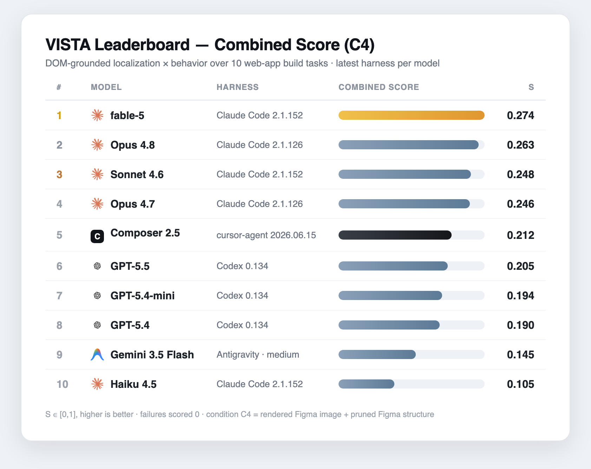

# VISTA — Visual-Spec → App Benchmark

**VISTA** ranks LLM coding agents on **end-to-end web-app generation from visual specs**: each task gives an agent a product's design and asks it to build a *runnable* full-stack app. We score how faithfully the result matches the spec — not just visually, but behaviorally — by matching every human-annotated UI anchor to a live DOM element and checking that it's both **placed correctly** and **actually works**.

An agent is a **model inside a harness** (e.g. `Opus 4.8` running in `Claude Code 2.1.126`). Both ship on their own cadence, so every run pins an exact harness version for reproducibility.

---

## 🏆 Leaderboard — Combined Score (condition C4)

<p align="center">
  
</p>

| # | Model | Provider | Harness | Combined S |
|--:|-------|----------|---------|:----------:|
| 1 | **fable-5** | Claude | Claude Code 2.1.152 | **0.274** |
| 2 | **Opus 4.8** | Claude | Claude Code 2.1.126 | **0.263** |
| 3 | **Sonnet 4.6** | Claude | Claude Code 2.1.152 | **0.248** |
| 4 | **Opus 4.7** | Claude | Claude Code 2.1.126 | **0.246** |
| 5 | **Composer 2.5** | Cursor | cursor-agent 2026.06.15 | **0.212** |
| 6 | **GPT-5.5** | OpenAI | Codex 0.134 | **0.205** |
| 7 | **GPT-5.4-mini** | OpenAI | Codex 0.134 | **0.194** |
| 8 | **GPT-5.4** | OpenAI | Codex 0.134 | **0.190** |
| 9 | **Gemini 3.5 Flash** | Antigravity | Antigravity · medium | **0.145** |
| 10 | **Haiku 4.5** | Claude | Claude Code 2.1.152 | **0.105** |

<sub>`S ∈ [0, 1]`, higher is better · mean over 10 apps, failures scored 0 · each model on its **latest harness release** · free choice of stack.</sub>

---

## How it's scored

```
visual spec ─▶ agent (model × harness) ─▶ runnable app ─▶ per-anchor DOM match ─▶ S
```

For each app the spec carries **critical UI anchors** annotated by humans. The evaluator brings the agent's app up under Docker, then for every anchor:

- **Localization (L)** — is the right element present, in the right place? (DOM match + bounding-box IoU/distance.)
- **Behavior (B)** — does it *do* the right thing? (Click navigates, input accepts, toggle flips, dialog opens…)

The per-anchor score is **L × B**, and the app's score is the mean over its critical anchors. **Combined score S** is the mean across all 10 apps (a missing or broken element scores 0). Because `S = L × B`, an app that looks right but doesn't work scores near zero — behavior is usually the bottleneck.

### Condition C4

The agent gets the **richest spec** and the **freest hand**: the page's **rendered Figma image** (a screenshot mockup) **and** its **pruned Figma structure** (the layout tree as JSON) — but **no target framework**. It picks its own stack.

---

## Notes & caveats

- **Latest harness per model.** Codex-CLI `0.134`, Claude Code `2.1.152` (Opus 4.7 / 4.8 shown on `2.1.126`), `cursor-agent 2026.06.15`, Antigravity (medium). Harness version is recorded per run.
- **Composer 2.5** runs via the headless `cursor-agent` CLI; its cache-hit ratio (~87–96%) is in line with Claude and Codex. Per-task range: `8_ecommerce` 0.41 (best) → `5_travel-booking` 0.106 (worst).
- **Externally-provided sets.** Opus 4.7 and GPT-5.4 results come from result sets that could not be re-verified against the corrected README page-mapping parser.
- **Incomplete runs omitted.** Gemini 3.1 Pro (High) and partial Gemini 3.5 runs are excluded pending all 10 tasks.

---

## Regenerating the leaderboard image

`readme_assets/leaderboard.png` is generated from the table data — edit `ROWS` in the script and re-run:

```bash
python3 readme_assets/render_leaderboard.py
```

It builds a styled HTML table (provider logos embedded), renders it with headless Google Chrome, and auto-crops the result with Pillow.
